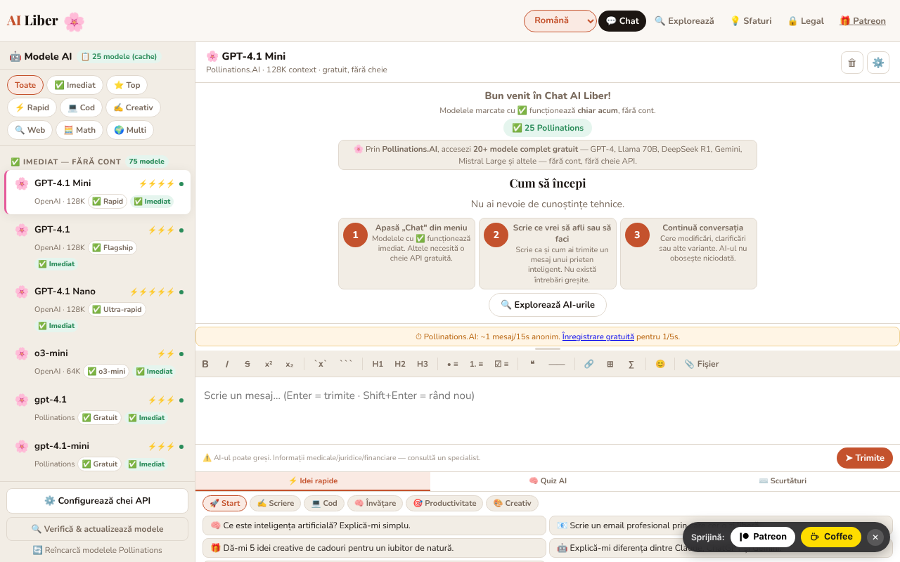

# AI Liber — Inteligența artificială pentru toți

Chat cu modele de inteligență artificială gratuite sau cu cheile tale API, plus un ghid al celor mai bune AI-uri gratuite, într-un singur fișier HTML.

**Live:** https://chiuta.github.io/AI-Liber/

## Ce este

AI Liber este o aplicație single-file (`index.html`) care oferă o interfață unică de chat către mai mulți furnizori de modele de limbaj: servicii gratuite, fără cont (de exemplu Pollinations, DuckDuckGo AI Chat, AI Horde), servicii cu cheie API proprie (OpenAI, Anthropic, Gemini, Groq, Mistral, OpenRouter, Perplexity), servere locale (Ollama, LM Studio) și un model rulat direct în browser prin WebLLM. Include și o secțiune cu un catalog de AI-uri gratuite, un quiz și idei de prompturi.

## Funcții

- Chat cu selector de model/furnizor, trimitere cu butonul „➤ Trimite”, oprirea unei cereri în curs.
- Bară de formatare Markdown (aldin, cursiv, tăiat, cod, listă, citat, tabel etc.).
- Panou „Configurează chei API” pentru furnizorii care cer cheie; cheile sunt păstrate local, obscurizate cu AES-GCM (aplicația avertizează explicit că aceasta nu este criptare robustă).
- Buton „Verifică & actualizează modele” pentru reîmprospătarea listei de modele.
- Suport pentru servere locale Ollama (`localhost:11434`) și LM Studio (`localhost:1234`) și pentru un model local în browser (WebLLM).
- Catalog „Cele mai bune AI-uri gratuite”, filtrabil pe categorii (Chat, Cercetare, Imagini, Video AI, Media, Cod, Scriere, Productivitate, Creativ) și pe „Fără cont” / „Local (browser)”.
- Panou inferior cu „⚡ Idei rapide” (prompturi), „🧠 Quiz AI” și „⌨️ Shortcuts”.
- Interfață în 7 limbi: română, engleză, franceză, germană, spaniolă, portugheză, italiană.
- Texte de confidențialitate (GDPR), termeni și informații despre cookie-uri/stocare locală, în fiecare limbă.

## Manual de utilizare

1. Deschide aplicația și alege limba din selectorul de limbă (Română, English, Français, Deutsch, Español, Português, Italiano).
2. Alege un model din listă. Modelele marcate „Fără cont” nu cer cheie.
3. Pentru un furnizor cu cheie: apasă „⚙️ Configurează chei API”, introdu cheia pentru furnizorul dorit și închide fereastra.
4. Scrie mesajul în câmpul de text și apasă Enter sau „➤ Trimite”. Shift+Enter inserează un rând nou.
5. Formatare: Ctrl+B (aldin), Ctrl+I (cursiv), Ctrl+Z (anulare); Esc închide ferestrele; ↑↓ navighează lista de modele.
6. Pentru modele locale: pornește Ollama cu `OLLAMA_ORIGINS=* ollama serve` sau serverul LM Studio pe portul 1234, apoi alege modelul local.
7. Folosește „⚡ Idei rapide”, „🧠 Quiz AI” sau secțiunea „Cele mai bune AI-uri gratuite” pentru inspirație și descoperire de servicii.
8. Pentru a șterge datele, folosește opțiunile descrise în fereastra de confidențialitate sau golește datele site-ului din browser.

## Confidențialitate și rețea

Aplicația **nu este strict offline**: chatul funcționează doar prin contactarea serviciilor alese de tine.

- **Stocare locală (localStorage):** limba (`ailib_lang`), chei API obscurizate (`aik_enc_*`, `aik_*`) cu o sare (`ailib_ksalt`), o listă locală de modele care au dat eroare 404 (`ailib_404`), o preferință de interfață (`ailib_sbw`). În `sessionStorage`: un secret de sesiune (`ailib_ssec`).
- **Gazde terțe contactate, la cerere:** `text.pollinations.ai`, `auth.pollinations.ai` (Pollinations); `duckduckgo.com` (DuckDuckGo AI Chat); `aihorde.net` (AI Horde); `api.openai.com`, `api.anthropic.com`, `generativelanguage.googleapis.com`, `api.perplexity.ai` și alte API-uri ale furnizorilor, doar dacă folosești cheia respectivă; `esm.run` (încărcarea WebLLM `@mlc-ai/web-llm@0.2.84`, doar când activezi modelul în browser) și, în funcție de model, descărcarea ponderilor de la gazdele WebLLM.
- Mesajele tale sunt trimise furnizorului ales; politicile lor se aplică. Cheile sunt trimise doar furnizorului căruia îi aparțin.
- Cataloagele conțin linkuri externe (doar navigare, la click).
- Serverele locale (`localhost`) sunt contactate doar dacă le selectezi; din pagini HTTPS browserul poate bloca apelurile către `http://localhost` (mixed content).

## Rulare locală / offline

Descarcă `index.html` și deschide-l în browser. Interfața, catalogul, quiz-ul și ghidurile funcționează fără internet; pentru orice răspuns de chat ai nevoie de conexiune la furnizorul ales (sau de un server local Ollama/LM Studio pornit pe calculatorul tău).

## Licență

CC0 1.0 Universal (domeniu public) — vezi fișierul LICENSE

## Autor

Alexio — Alexandru-Ionuț Chiuță, contact: alexio@trom.tf. Aplicația este oferită în spiritul mișcării trade-free TROM (trom.tf); sprijinul voluntar este opțional.

## English summary

AI Liber is a single-file HTML chat front-end for free no-account AI services, bring-your-own-key APIs, local Ollama/LM Studio servers and an in-browser WebLLM model, plus a directory of free AI tools, a quiz and prompt ideas. 7 UI languages. Keys are kept in localStorage (AES-GCM obfuscated, not strong encryption). Chat requires internet access to the chosen provider. CC0.
